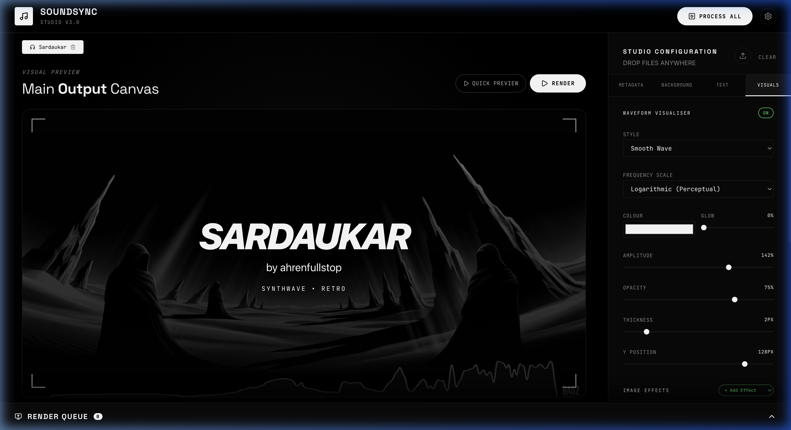

# 🎵 SoundSync Studio v3
[](https://opensource.org/licenses/MIT)
[](https://react.dev/)
[](https://nodejs.org/)
[](https://ffmpeg.org/)

**SoundSync Studio** is a high-performance, self-hosted web application designed for music producers and artists to generate professional, audio-reactive visualizers. Turn your `.mp3` or `.wav` masters into polished, YouTube-ready `.mp4` videos with zero subscription fees.

---

## ✨ Experience the Studio



---

## 🚀 Key Features

- **🎯 Precision Typography Control:** Complete layout decoupling. Move, scale, and align Title, Artist, and Tags individually with real-time preview.
- **🌊 Audio-Reactive Waveforms:** High-fidelity waveforms synced perfectly to your audio. Choose from multiple styles (Bars, Pulse, Smooth) with customizable colors and glow.
- **🤖 Gemini AI Visuals:** Integrated Google Imagen API. Generate stunning 16:9 backgrounds from text prompts directly within your workflow.
- **⚙️ Pro Rendering Engine:** Powered by a robust FFmpeg pipeline using `libx264` and `aac` for maximum compatibility and quality.
- **📦 Batch Processing:** Queue up entire albums. Configure multiple tracks in parallel and render them all with a single click.
- **🎬 Visual Effects:** Dynamic corner brackets, vignette controls, and backdrop overlays to give your videos a premium cinematic feel.

---

## 🛠️ Tech Stack

- **Frontend:** [React 19](https://react.dev/), TypeScript, Vite, Vanilla CSS
- **Backend:** [Node.js](https://nodejs.org/), Express, TypeScript
- **Processing:** [FFmpeg](https://ffmpeg.org/), [Sharp](https://sharp.pixelplumbing.com/)
- **Intelligence:** [Google Gemini API](https://ai.google.dev/) (Imagen)

---

## 🏁 Quick Start Guide

### 1️⃣ Prerequisites
Ensure you have the following installed:
- **Node.js** (v18+)
- **FFmpeg** (Required for the rendering engine)
  - `brew install ffmpeg` (Mac)
  - `sudo apt install ffmpeg` (Linux)

### 2️⃣ Installation
```bash
# Clone the repository
git clone https://github.com/AhrenFullStop/sound-sync.git

# Enter the directory
cd sound-sync

# Install dependencies
npm install
```

### 3️⃣ Environment Configuration
Create a `.env` file in the root directory:
```env
GEMINI_API_KEY=your_gemini_api_key_here
PORT=3001
# Optional YouTube Integration
YOUTUBE_CLIENT_ID=your_id
YOUTUBE_CLIENT_SECRET=your_secret
```

### 4️⃣ Launch the Studio
```bash
npm run dev
```
Open **`http://localhost:5173`** to start creating.

---

## 📂 Project Structure

```text
sound-sync/
├── data/               # Local storage for audio, images, and renders
├── server/             # Express API & FFmpeg filter-graphs
├── src/                # React Studio UI & Canvas state
├── public/             # Static assets and fonts
└── vite.config.ts      # Proxy & Build configuration
```

---

## 🤝 Contributing
Contributions are what make the open-source community an amazing place to learn, inspire, and create. Any contributions you make are **greatly appreciated**.

1. Fork the Project
2. Create your Feature Branch (`git checkout -b feature/AmazingFeature`)
3. Commit your Changes (`git commit -m 'Add some AmazingFeature'`)
4. Push to the Branch (`git push origin feature/AmazingFeature`)
5. Open a Pull Request

---

## 📜 License
Distributed under the MIT License. See `LICENSE` for more information.

<p align="center">Built with ❤️ for artists by AhrenFullStop</p>
